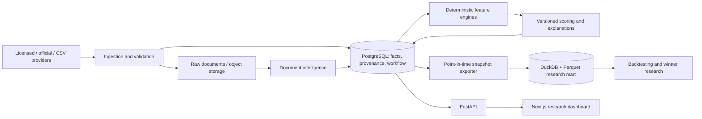
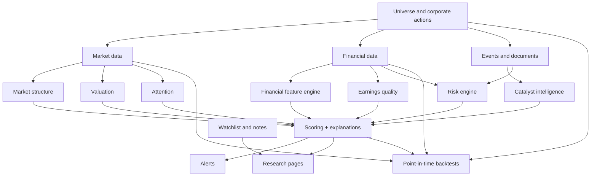

# Architecture

## Decision

Use a modular monolith: one FastAPI application, one separately deployed
scheduler/worker process from the same Python codebase, one Next.js web
application, PostgreSQL as the immutable operational source of truth, and
DuckDB over versioned analytical extracts for research workloads. Docker
Compose is the only deployment orchestration required initially. Redis is not
part of the initial architecture.

This gives the personal product a simple operational shape while keeping
provider ingestion, deterministic research, and user-facing workflow cleanly
separated.

## Logical components

### Applications

| Application | Responsibility | Must not own |
|---|---|---|
| `apps/api` | Auth gate, read/write API, OpenAPI contract, research workflow | calculations, provider-specific parsing |
| `apps/worker` | APScheduler, ingestion, validation, feature/score jobs, alerts | a separate business model |
| `apps/web` | Dashboard and research UI | finance calculations or provider access |
| `packages/core` | domain types, ports, formulas, scoring, backtesting, services | HTTP/UI/database framework glue |
| `packages/database` | ORM models, repositories, migrations, transactional access | scoring decisions |
| `packages/data` | provider adapters, normalization, raw archival, quality rules | UI/API behavior |

Phase 1 should create this physical layout, without creating empty feature
folders solely for appearance. New domains graduate into packages only once
they have a real interface or implementation.

### Phase 2A ingestion boundary

Phase 2A makes `packages/data` concrete: `UniverseProvider` and
`MarketDataProvider` return typed provider-neutral envelopes, never ORM
objects. The ingestion service archives a whole raw batch by SHA-256 before it
creates an ingestion run/source record, validates the parsed observation, and
normalizes accepted observations through database repositories. Local storage
uses a configurable content-addressed filesystem root; an S3-compatible store
can later satisfy the same raw-object port. The immutable source identity is
provider dataset + external record ID + content SHA-256, while corrections with
changed content append a new source and price bar for future PIT selection.
Raw archival completes before a run is committed. Any later exception rolls
back the active normalization transaction and finalizes that run as `failed`,
with counters and an error message, before the exception is propagated.

Phase 2B extends the same spine through `FinancialsProvider` to append-only
fiscal periods, filing headers, controlled metric definitions, and financial
facts. A filing is a reporting event that may contain many periods and both
standalone and consolidated scopes; future PIT selection, rather than ingestion,
will decide how to select among valid revisions and scopes.

Phase 2C adds provider-neutral corporate-action observations and explicit
security succession. Action terms are stored exactly and separately from later
price-adjustment derivations; exchange symbols are dated listings rather than
mutable security attributes. Corporate-action event identity is provider-dataset
scoped, with a cash-dividend `ex_date` then `effective_date` fallback and an
`effective_date` anchor for other supported action types. Listing intervals use
half-open temporal semantics and succession edges are cycle-checked before
persistence.

Phase 3A adds a read-only `PointInTimeFinancialReader` in `packages/data`.
It selects accepted immutable financial facts only after an explicit provider
dataset, filing scope, and UTC-aware `as_of` cutoff are supplied. The layer
does not reconcile provider evidence or derive financial features; see
[`point-in-time.md`](point-in-time.md) for its selection and tie-break rules.

Phase 3B adds `FiscalQuarterNormalizer`, another read-only `packages/data`
service. It derives only compatible additive monetary duration quarters from
PIT-selected components and retains structured source lineage. It creates no
derived fact tables or financial features; see
[`period-normalization.md`](period-normalization.md).

### Frontend boundary and state

`apps/web` uses the Next.js App Router and strict TypeScript. Server-rendered
routes are the default for initial document/data reads; client components are
small interactive islands for filters, charts, watchlist actions, and later
cached API state. The FastAPI OpenAPI contract is the API boundary; do not
duplicate financial/scoring logic in TypeScript. Explore state belongs in URL
search parameters, local ephemeral UI state remains local, and TanStack Query
is deferred until Phase 5 requires client-side server-state caching.

The first owned design primitives live in `apps/web/components/ui`, added
selectively through shadcn/ui and styled to the product design specification.
Lucide is the Phase 1 icon set. TanStack Table, ECharts, Lightweight Charts,
command palette support, virtualisation, and resizable panels are Phase 5 or
measured-need additions; see `docs/product-design.md` for the dependency
decision record. This avoids a premature shared UI package or dashboard-library
bundle.

## Data and time model

PostgreSQL holds canonical identities, raw-to-normalized observations,
provenance, user workflow, versioned feature/score output, and job history.
Financial values are append-only observations keyed by source revision,
period, statement scope, metric, and availability time. Prices are immutable
daily bars subject to explicit correction revisions. Documents live in an
S3-compatible object store in production and a mounted local path in
development; PostgreSQL stores hashes and metadata, not PDF blobs.

DuckDB is a disposable analytical projection, rebuilt from a named PostgreSQL
export to partitioned Parquet. It is never a second operational source of
truth. Each exported mart has a manifest containing source watermark, schema
version, model versions, and checksums.

All timestamps are UTC. A fact is usable in an `as_of` decision only when its
`available_at` is at or before that decision timestamp. Its `published_at` and
`reported_at` are retained independently. `ingested_at` permits a stricter
"as actually captured by this system" replay. Revisions append new records;
they never mutate prior knowledge. The default research/backtest policy is
public availability, with a selectable captured-data policy for operations.

## Module dependency graph

Arrows denote permitted dependency direction. `core` exposes ports such as
`CompanyRepository`, `FactRepository`, `DataProvider`, `DocumentStore`, and
`Clock`; adapter packages implement them. Scoring reads feature snapshots and
reviewed event facts, not raw documents or provider clients.

## External interfaces

All provider adapters conform to a common envelope: `provider_id`, source URL
or object key, retrieval time, source checksum, published/available time,
licence tag, cursor, and validation results.

| Port | Minimum operations | Initial adapter |
|---|---|---|
| `UniverseProvider` | listings, ISINs, classifications, status, aliases | CSV/manual/mock |
| `MarketDataProvider` | daily bars, delivery, market cap, corrections | CSV/manual/mock |
| `FinancialsProvider` | filing headers, line items, restatements | CSV/manual/mock |
| `CorporateActionProvider` | split, bonus, dividend, merge, delisting | CSV/manual/mock |
| `DisclosureProvider` | announcements, filings, document references | CSV/manual/mock |
| `OwnershipProvider` | promoter, MF, FII/FPI, pledge holdings | CSV/manual/mock |
| `AttentionProvider` | coverage/news/search/volume proxies | CSV/manual/mock |
| `DocumentStore` | put/get immutable bytes by checksum | local/S3-compatible |
| `AIInterpreter` | structured extraction with citations | disabled-by-default/mock |
| `NotificationChannel` | create in-app notification | database adapter |

Official NSE/BSE/licensed adapters are deliberately deferred until their
contracts and permitted fields are verified. API adapters must expose cursors,
rate limits, retry classification, and deterministic idempotency keys.

## Deployment, auth, and observability

Phase 1 Compose runs `postgres` only; FastAPI and Next.js run locally with hot
reload, which keeps the development loop fast and failures legible. Future
production Compose may add API, worker, web, and object-store services only
when deployment—not local development—requires them. Development uses hot
reload and a local `.env`.
Production uses a reverse proxy/TLS outside the app, managed PostgreSQL or
volume backups, and a private network. Authentication is explicitly deferred
from the Phase 1 vertical slice; there are no roles or registration flows.

Every job has correlation ID, provider run, start/finish/status, counters,
watermarks, exception details, and freshness measurements. JSON structured
logs go to stdout. Health endpoints cover app, database, migration revision,
and provider freshness—not merely process liveness.

Back up PostgreSQL daily with encrypted off-host retention, test restore
quarterly, and retain raw-source/document objects and Parquet manifests needed
to reproduce research. DuckDB files can be regenerated.

## Key architectural risks and mitigations

| Risk | Mitigation |
|---|---|
| Market-data licensing changes | Provider contracts, licence metadata, manual import fallback, no redistribution features |
| Look-ahead and revised facts | immutable revisions, `available_at` query guard, PIT tests and manifests |
| Symbol/ISIN churn | company-first identity, dated listings and aliases, corporate-action ledger |
| Unit and filing-format errors | unit normalization with source retention, validation/quarantine, human review queue |
| AI hallucination | AI is evidence-linked, confidence-scored, reviewable, and cannot write financial facts |
| Thin-liquidity false positives | liquidity/risk flags, universe eligibility rules, separate market-structure component |

## Licensing and compliance posture

Do not assume that public availability permits automated collection, storage,
analysis, or redistribution. NSE's data policy covers data usage and
redistribution and subjects subscribers to relevant agreements; it also offers
separate paid historical/EOD products. Review the current agreement before any
official adapter is enabled. BSE information products likewise publish datafeed
pricing. This personal tool must record each dataset's licence and prohibit
export/API redistribution by default. Corporate disclosures remain source
documents with immutable links and attribution; the system is research tooling,
not investment advice. See [NSE's data policy](https://www.nseindia.com/static/market-data/nse-data-policy), [NSE historical/EOD subscription](https://www.nseindia.com/static/market-data/eod-historical-data-subscription), [BSE information-products tariff](https://www.bseindia.com/downloads1/Information_Products_Pricing_Sheet.pdf), and [SEBI LODR regulations](https://www.sebi.gov.in/legal/regulations/may-2024/securities-and-exchange-board-of-india-listing-obligations-and-disclosure-requirements-regulations-2015-last-amended-on-may-17-2024-_80422.html).
