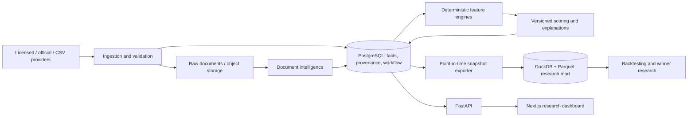
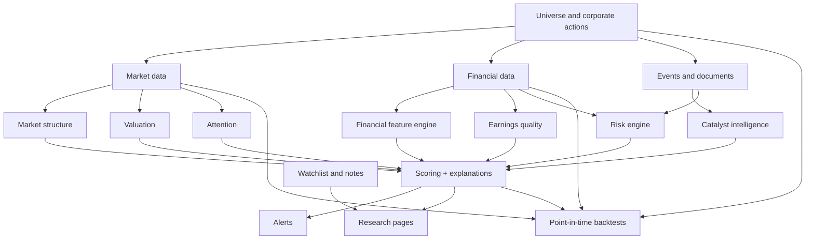

# Architecture

## Decision

Use a modular monolith: one FastAPI application, one separately deployed
scheduler/worker process from the same Python codebase, one Next.js web
application, PostgreSQL as the immutable operational source of truth, and
DuckDB over versioned analytical extracts for research workloads. Docker
Compose is the only deployment orchestration required initially. Redis is not
part of the initial architecture.

This gives the personal product a simple operational shape while keeping
provider ingestion, deterministic research, and user-facing workflow cleanly
separated.

## Logical components

```mermaid
flowchart LR
  P[Licensed / official / CSV providers] --> I[Ingestion and validation]
  I --> PG[(PostgreSQL: facts, provenance, workflow)]
  I --> O[Raw documents / object storage]
  PG --> F[Deterministic feature engines]
  O --> C[Document intelligence]
  C --> PG
  F --> S[Versioned scoring and explanations]
  S --> PG
  PG --> X[Point-in-time snapshot exporter]
  X --> D[(DuckDB + Parquet research mart)]
  D --> B[Backtesting and winner research]
  PG --> A[FastAPI]
  A --> W[Next.js research dashboard]
```

### Applications

| Application | Responsibility | Must not own |
|---|---|---|
| `apps/api` | Auth gate, read/write API, OpenAPI contract, research workflow | calculations, provider-specific parsing |
| `apps/worker` | APScheduler, ingestion, validation, feature/score jobs, alerts | a separate business model |
| `apps/web` | Dashboard and research UI | finance calculations or provider access |
| `packages/core` | domain types, ports, formulas, scoring, backtesting, services | HTTP/UI/database framework glue |
| `packages/database` | ORM models, repositories, migrations, transactional access | scoring decisions |
| `packages/data` | provider adapters, normalization, raw archival, quality rules | UI/API behavior |

Phase 1 should create this physical layout, without creating empty feature
folders solely for appearance. New domains graduate into packages only once
they have a real interface or implementation.

### Phase 2A ingestion boundary

Phase 2A makes `packages/data` concrete: `UniverseProvider` and
`MarketDataProvider` return typed provider-neutral envelopes, never ORM
objects. The ingestion service archives a whole raw batch by SHA-256 before it
creates an ingestion run/source record, validates the parsed observation, and
normalizes accepted observations through database repositories. Local storage
uses a configurable content-addressed filesystem root; an S3-compatible store
can later satisfy the same raw-object port. The immutable source identity is
provider dataset + external record ID + content SHA-256, while corrections with
changed content append a new source and price bar for future PIT selection.
Raw archival completes before a run is committed. Any later exception rolls
back the active normalization transaction and finalizes that run as `failed`,
with counters and an error message, before the exception is propagated.

Phase 2B extends the same spine through `FinancialsProvider` to append-only
fiscal periods, filing headers, controlled metric definitions, and financial
facts. A filing is a reporting event that may contain many periods and both
standalone and consolidated scopes; future PIT selection, rather than ingestion,
will decide how to select among valid revisions and scopes.

Phase 2C adds provider-neutral corporate-action observations and explicit
security succession. Action terms are stored exactly and separately from later
price-adjustment derivations; exchange symbols are dated listings rather than
mutable security attributes. Corporate-action event identity is provider-dataset
scoped, with a cash-dividend `ex_date` then `effective_date` fallback and an
`effective_date` anchor for other supported action types. Listing intervals use
half-open temporal semantics and succession edges are cycle-checked before
persistence.

Phase 3A adds a read-only `PointInTimeFinancialReader` in `packages/data`.
It selects accepted immutable financial facts only after an explicit provider
dataset, filing scope, and UTC-aware `as_of` cutoff are supplied. The layer
does not reconcile provider evidence or derive financial features; see
[`point-in-time.md`](point-in-time.md) for its selection and tie-break rules.

Phase 3B adds `FiscalQuarterNormalizer`, another read-only `packages/data`
service. It derives only compatible additive monetary duration quarters from
PIT-selected components and retains structured source lineage. It creates no
derived fact tables or financial features; see
[`period-normalization.md`](period-normalization.md).

Phase 3C adds `TrailingTwelveMonthNormalizer`, a read-only aggregation over
only those PIT-clean quarterized values. It sums exactly four continuous
additive monetary INR quarters, retains nested quarter/fact provenance, and
does not persist a TTM or use annual/YTD fallback algebra; see
[`ttm.md`](ttm.md).

Phase 3D adds read-only growth, acceleration, and margin primitives over
PIT-clean quarterized values. They retain selected-quarter lineage and apply no
provider preference, feature persistence, or scoring policy; see
[`financial-inflection-features.md`](financial-inflection-features.md).

Phase 3E-A adds `InstantFinancialSnapshotReader`, a read-only same-period
selection layer over PIT financial facts. It intersects eligible instant
monetary INR facts by exact stored `FiscalPeriod.id` and defines latest by
economic `period_end`, never by arrival time. It persists nothing and performs
no balance-sheet ratios; see [`financial-snapshots.md`](financial-snapshots.md).

Phase 3E-B adds `CapitalEfficiencyFeatures`, a read-only calculation layer over
explicit snapshot and TTM dependencies. Net debt, debt/equity, interest
coverage, ROE, and ROCE retain their nested source lineage and conservative
denominator warnings. No feature is persisted or scored; see
[`capital-efficiency-features.md`](capital-efficiency-features.md).

Phase 3E-C adds `CashFlowQualityFeatures` over the same explicit snapshot and
TTM boundaries. It calculates CFO/PAT, CFO/reported-EBITDA, receivable days,
and trade working-capital change with exact Decimal arithmetic, PIT-visible
revisions, and full nested lineage. Exact balance-sheet dates are mandatory;
provider and filing scope never fall back. FCF and cash-conversion-cycle
formulas remain deferred until capex-sign and denominator semantics are
controlled. See
[`cash-flow-quality-features.md`](cash-flow-quality-features.md).

Phase 3F adds `GrowthHistoryFeatures`, a final read-only Phase 3 aggregation
layer over the public Phase 3D YoY series. It requires complete fixed windows
of consecutive percentage-mode observations, then exposes exact positive share
and explicit-threshold persistence with stopping/saturation lineage. It does
not query raw facts, bridge missing or loss-transition observations, persist
features, or apply scoring policy; see
[`growth-history-features.md`](growth-history-features.md).

Phase 4A introduces the policy/control boundary before scoring. Frozen typed
policy models live in `packages/core`; immutable model/configuration rows and
active-policy resolution live in `packages/database`. Pure context,
eligibility, and confidence evaluators consume supplied evidence without
querying financial facts or producing score points. Overlapping active policy
intervals fail closed. See [`scoring-policy.md`](scoring-policy.md).

Phase 4B adds a pure `packages/core` Financial Inflection component scorer. It
normalizes six coherent Phase 3 evidence objects through versioned Decimal
piecewise-linear curves, applies a configured coverage gate, and renormalizes
only available subfactor weights. It does not query providers or persistence,
apply confidence or the top-level component weight, calculate a final score, or
write score tables. See
[`financial-inflection-scoring.md`](financial-inflection-scoring.md).

Phase 4C adds the immutable persistence/orchestration spine. The data-layer
orchestrator resolves active policy, evaluates eligibility and confidence,
scores candidate financial contexts independently, applies configured context
priority, and asks the database repository to idempotently persist a snapshot,
one selected Financial Inflection component, and structured subfactor
explanations. The final score remains null because seven top-level components
are not implemented. See [`score-snapshots.md`](score-snapshots.md).

Phase 4D-A adds a second pure `packages/core` scorer for Business Quality. It
scores current ROCE, ROE, and an explicitly configured quarter-margin level
using the existing Phase 4B Decimal curve implementation. It preserves strict
context/cutoff/endpoint coherence and does not change Phase 4C orchestration or
persistence. See [`business-quality-scoring.md`](business-quality-scoring.md).

Phase 4D-B adds a pure Cash-Flow Quality scorer over Phase 3E-C evidence. It
retains accounting raw values while making the lower-is-better receivable-days
and revenue-normalized trade-working-capital transforms explicit. It reuses the
same Decimal curve implementation and likewise does not enter Phase 4C
orchestration or persistence. See
[`cash-flow-quality-scoring.md`](cash-flow-quality-scoring.md).

Phase 4D-C adds a pure Balance Sheet scorer for net debt/TTM reported EBITDA,
debt/equity, and interest coverage. It validates exact context, cutoff,
endpoint, economic period end, and stored stock-period identity before applying
explicit size-neutral leverage transforms. See
[`balance-sheet-scoring.md`](balance-sheet-scoring.md).

Phase 4D-D adds the explicitly versioned `score_snapshot_v2` orchestration path
without changing the Phase 4C/v1 contract. It scores the four approved
financial components independently inside each supplied provider/scope context,
selects one context by configured provider-first lexicographic priority, and
persists every scoreable positive-weight component from that context. It never
selects by score or coverage, never borrows across contexts, and keeps final
scores, final contributions, and confidence multiplication absent. See
[`financial-component-orchestration.md`](financial-component-orchestration.md).

### Frontend boundary and state

`apps/web` uses the Next.js App Router and strict TypeScript. Server-rendered
routes are the default for initial document/data reads; client components are
small interactive islands for filters, charts, watchlist actions, and later
cached API state. The FastAPI OpenAPI contract is the API boundary; do not
duplicate financial/scoring logic in TypeScript. Explore state belongs in URL
search parameters, local ephemeral UI state remains local, and TanStack Query
is deferred until Phase 5 requires client-side server-state caching.

The first owned design primitives live in `apps/web/components/ui`, added
selectively through shadcn/ui and styled to the product design specification.
Lucide is the Phase 1 icon set. TanStack Table, ECharts, Lightweight Charts,
command palette support, virtualisation, and resizable panels are Phase 5 or
measured-need additions; see `docs/product-design.md` for the dependency
decision record. This avoids a premature shared UI package or dashboard-library
bundle.

## Data and time model

PostgreSQL holds canonical identities, raw-to-normalized observations,
provenance, user workflow, versioned feature/score output, and job history.
Financial values are append-only observations keyed by source revision,
period, statement scope, metric, and availability time. Prices are immutable
daily bars subject to explicit correction revisions. Documents live in an
S3-compatible object store in production and a mounted local path in
development; PostgreSQL stores hashes and metadata, not PDF blobs.

DuckDB is a disposable analytical projection, rebuilt from a named PostgreSQL
export to partitioned Parquet. It is never a second operational source of
truth. Each exported mart has a manifest containing source watermark, schema
version, model versions, and checksums.

All timestamps are UTC. A fact is usable in an `as_of` decision only when its
`available_at` is at or before that decision timestamp. Its `published_at` and
`reported_at` are retained independently. `ingested_at` permits a stricter
"as actually captured by this system" replay. Revisions append new records;
they never mutate prior knowledge. The default research/backtest policy is
public availability, with a selectable captured-data policy for operations.

## Module dependency graph

```mermaid
flowchart TD
  U[Universe and corporate actions] --> MD[Market data]
  U --> FD[Financial data]
  U --> ED[Events and documents]
  FD --> FE[Financial feature engine]
  MD --> MS[Market structure]
  MD --> VE[Valuation]
  FD --> EQ[Earnings quality]
  ED --> CI[Catalyst intelligence]
  FD --> RE[Risk engine]
  ED --> RE
  MD --> AT[Attention]
  FE --> SC[Scoring + explanations]
  EQ --> SC
  CI --> SC
  RE --> SC
  VE --> SC
  MS --> SC
  AT --> SC
  SC --> AL[Alerts]
  SC --> RP[Research pages]
  SC --> BT[Point-in-time backtests]
  U --> BT
  MD --> BT
  FD --> BT
  WL[Watchlist and notes] --> RP
```

Arrows denote permitted dependency direction. `core` exposes ports such as
`CompanyRepository`, `FactRepository`, `DataProvider`, `DocumentStore`, and
`Clock`; adapter packages implement them. Scoring reads feature snapshots and
reviewed event facts, not raw documents or provider clients.

## External interfaces

All provider adapters conform to a common envelope: `provider_id`, source URL
or object key, retrieval time, source checksum, published/available time,
licence tag, cursor, and validation results.

| Port | Minimum operations | Initial adapter |
|---|---|---|
| `UniverseProvider` | listings, ISINs, classifications, status, aliases | CSV/manual/mock |
| `MarketDataProvider` | raw daily OHLCV plus optional delivery and provider-reported market cap; corrections | CSV/mock implemented; manual/official deferred |
| `BenchmarkDataProvider` | provider-local benchmark identity and raw daily OHLC corrections | CSV/mock implemented; official deferred |
| `FinancialsProvider` | filing headers, line items, restatements | CSV/manual/mock |
| `CorporateActionProvider` | split, bonus, dividend, merge, delisting | CSV/manual/mock |
| `AnnouncementProvider` | public announcement and document metadata | CSV/mock implemented; official exchange adapters deferred |
| `OwnershipProvider` | promoter, MF, FII/FPI, pledge holdings | CSV/manual/mock |
| `AttentionProvider` | coverage/news/search/volume proxies | CSV/manual/mock |
| `DocumentStore` | put/get immutable bytes by checksum | local/S3-compatible |
| `AIInterpreter` | structured extraction with citations | disabled-by-default/mock |
| `NotificationChannel` | create in-app notification | database adapter |

Official NSE/BSE/licensed adapters are deliberately deferred until their
contracts and permitted fields are verified. API adapters must expose cursors,
rate limits, retry classification, and deterministic idempotency keys.

Phase 2D-A implements the provider-neutral raw storage and CSV/mock paths
described above. Phase 3G-A adds explicit-provider market/benchmark PIT reads
using accepted sources and `available_at <= as_of`, while preserving each
selected row atomically. Phase 3G-B adds in-memory split/bonus-adjusted OHLC and
adjacent simple security/benchmark returns. Phase 3G-C now composes those views
into non-persisted, non-scored benchmark-relative, trend, volatility,
consolidation, raw close-times-volume, and delivery primitives under three
explicit provider contexts. Phase 3H-A combines the atomic
provider-reported PIT market cap with exact-context TTM and instant financial
evidence into non-persisted conservative valuation primitives. Valuation
scoring is pure and complete, while dividend total returns, rights adjustment,
sector-relative benchmark mapping, and attention evidence remain deferred. See
[`market-data-enrichment.md`](market-data-enrichment.md),
[`market-point-in-time.md`](market-point-in-time.md), and
[`market-adjustments-and-returns.md`](market-adjustments-and-returns.md).
Market Structure evidence semantics are documented in
[`market-structure-features.md`](market-structure-features.md).
Valuation evidence semantics are documented in
[`valuation-features.md`](valuation-features.md).

Phase 4D-E adds a pure Valuation scorer over those five Phase 3H-A ratios. It
uses an optional versioned policy section and persists nothing. Because the
bundle declares a separate market provider as well as financial provider/scope,
the scorer is intentionally absent from `score_snapshot_v2`; no existing
context selection, fingerprint, component coverage, or final-score semantics
change. See [`valuation-scoring.md`](valuation-scoring.md).

Phase 4D-F adds a pure, non-persisted scorer over seven approved Phase 3G-C
Market Structure primitives. It validates exact market, corporate-action,
benchmark, security, interval, cutoff, basis-date, and source lineage already
carried by the bundle; it performs no PIT reads or feature recomputation.
Absolute volatility and absolute close-times-volume remain unscored. The
reserved top-level 5%, confidence, eligibility, and final aggregation are not
applied. At that phase, pure scorer availability reached 0.75 of standard
top-level weight, while v2 persisted coverage remained 0.60. See
[`market-structure-scoring.md`](market-structure-scoring.md).

Phase 4D-G adds a separate `score_snapshot_v3` boundary. It composes the four
financial scorers, Valuation, and Market Structure without changing v1/v2.
Financial provider/scope selection remains provider-first and may consider
Valuation scoreability; Market Structure is evaluated afterward from one
caller-supplied security/market/action/benchmark context and cannot select the
financial source. Component-specific recursive lineage is unioned into the v3
snapshot fingerprint. V3 maximum standard coverage is 0.75, while
`final_score` and final contributions remain null. See
[`cross-domain-score-orchestration.md`](cross-domain-score-orchestration.md).

Phase 6A adds the first source-evidence boundary for public announcements and
associated document metadata. `AnnouncementProvider` adapters return immutable
provider-neutral batches; ingestion archives the complete batch before
validation and appends accepted announcement revisions, revision-owned
document metadata, and source lineage. A dedicated PIT reader selects one
revision per provider dataset/external ID using public availability. It does
not acquire document bytes, extract text, invoke AI, classify catalysts or
risks, or change scoring. See
[`announcement-document-evidence.md`](announcement-document-evidence.md).

Phase 6B adds a second, still non-interpretive evidence boundary. A bounded
offline fetch port acquires exact document bytes into content-addressed
storage; deterministic plain-text and `pypdf` extractors create immutable text
objects with explicit semantic/runtime identities and page-offset hashes.
Readers consume an already PIT-selected Phase 6A document, so source
`available_at` remains distinct from operational retrieval and extraction
times. No HTTP fetcher, OCR, AI, event classification, score, or snapshot
change is introduced. See
[`document-acquisition-and-text.md`](document-acquisition-and-text.md).

Phase 6C-A adds a neutral deterministic derivation boundary after Phase 6B.
The pure `business_event_rules_v1` engine operates on the immutable headline
and on each canonical document page independently. Persistence creates one
`BusinessEvent` per immutable announcement revision/event type/ruleset and any
number of exact citable evidence spans. Readers apply Phase 6A announcement
revision selection before exposing events, so corrections can remove or change
the PIT-visible type without mutating earlier derivations. This boundary adds
no quantities, materiality, sentiment, confidence, AI, scorer, or snapshot
version. See [`business-event-primitives.md`](business-event-primitives.md).

Phase 6C-B adds a second deterministic derivation boundary that consumes only
persisted Phase 6C-A evidence excerpts. The pure
`business_event_quantitative_rules_v1` parser emits exact monetary, capacity,
stake-fraction, or commencement-date observations into an immutable derivation
envelope; an empty envelope is persisted when no supported quantity exists.
Exact source offsets, raw-text hashes, event/evidence fingerprints, and
reported/normalized values preserve attribution. No whole-document rescan,
financial join, FX conversion, materiality arithmetic, direction, confidence,
AI, scorer, or snapshot change is introduced. See
[`business-event-quantitative-facts.md`](business-event-quantitative-facts.md).

Phase 6C-C is a read-only feature boundary over one selected event. Equivalent
quantitative observations resolve by exact normalized semantics without
summing; conflicts remain unavailable. Materiality denominators come only from
the caller-declared provider/scope's latest PIT `ttm_v1` revenue at the event's
source availability time, while raw event age uses the later requested cutoff.
The immutable in-memory bundle retains event, quantitative-fact, TTM-quarter,
financial-fact, and source lineage. No schema, market data, FX, AI, provider
selection, event aggregation, scoring policy, or snapshot changes are added.
See [`business-event-features.md`](business-event-features.md).

Phase 4D-H adds a pure Business Catalyst scoring boundary over an explicit,
coherent set of Phase 6C-C bundles. Four types are scoreable: quantified order
awards, quantified capacity expansions, commercial commencement, and
regulatory approval. Capex announcements and acquisition agreements remain
neutral and auditable but unscoreable. Exact event strength is multiplied by a
versioned recency signal, and `max_event_score_v1` selects one result without
summing, averaging, or counting duplicate disclosures. The scorer retains the
full feature bundle and selects neither the event provider nor financial
provider/scope. It creates no persistence or snapshot version. Pure scorer
availability is 0.95 of top-level weight, while persisted v3 coverage remains
0.75 and `final_score` remains null. See
[`business-catalyst-scoring.md`](business-catalyst-scoring.md).

Phase 4D-I adds a new, isolated `score_snapshot_v4` orchestration boundary.
The unchanged V3 provider-first/scope-priority selector chooses the financial
context before either Market Structure or Business Catalyst is evaluated.
Business Catalyst candidates bind one explicit event provider and a coherent
PIT event set to each financial context; neither catalyst score nor coverage
can influence accounting-source selection. The selected-context score is
persisted in canonical top-level order with one selected-event explanation and
a V4-only union of announcement, document, byte/text, event, quantitative,
financial, and market lineage. Operational acquisition/derivation times do not
enter semantic fingerprints. Maximum V4 coverage is 0.95; Low Market Attention
and all final scores/contributions remain absent. V1/V2/V3 payloads and
fingerprints remain unchanged. See
[`business-catalyst-snapshot-orchestration.md`](business-catalyst-snapshot-orchestration.md).

Phase 6D-A adds an independent external-attention source boundary. Provider
batches are archived before append-only normalization into explicit
news-mention windows or analyst-coverage snapshots. Provider dataset, scope,
methodology, definition hash, and company/security identity remain explicit;
mandatory source availability drives PIT reads and operational timestamps do
not. Corrections resolve first by external ID and then by economic measurement
identity. Market activity and BusinessEvents are deliberately absent from this
domain. No attention feature, AI, policy, score, snapshot change, or final score
is introduced. See [`attention-evidence.md`](attention-evidence.md).

Phase 6D-B adds a read-only feature boundary over that PIT reader. Callers
provide exact news and analyst series identities, explicit company/security
mode, exact news window, analyst bound, and aware cutoff. Complete counts,
including zero, become Decimal primitives; partial/unknown counts remain
unavailable but retain their evidence and temporal metadata. News duration and
age use exact Decimal elapsed time, and analyst age uses calendar days. There
is no provider fallback, persistence, market or event normalization, peer
ranking, AI, policy, score, migration, or snapshot change. See
[`attention-features.md`](attention-features.md).

Phase 4D-J adds a pure Low Market Attention scoring boundary. The policy binds
exact news and analyst series identities and evidence level; UTC-day-start
alignment prevents historical news-window shopping, while scoring requires the
latest PIT analyst snapshot. Counts are scored only when complete, fresh, and
comparable. The scorer retains the full feature bundle and performs no reads,
market/event/peer normalization, AI, persistence, top-level contribution, or
snapshot change. Pure scorer coverage reaches 1.00, but persisted V4 remains
0.95 with a null final score. See
[`low-market-attention-scoring.md`](low-market-attention-scoring.md).

Phase 4D-K adds an isolated `score_snapshot_v5` orchestration and persistence
boundary. V3 financial-context selection remains authoritative; Business
Catalyst, Market Structure, and Low Market Attention run only after selection.
V5 adds a semantic attention lineage union without changing V1-V4 manifests.
Only a complete exact weight-coverage set activates Decimal top-level
contributions and `opportunity_score_weighted_sum_v1`; partial evidence stays
null and is never renormalized. The reference score is `70.675`. Existing
columns are sufficient, so there is no migration. See
[`opportunity-score-activation.md`](opportunity-score-activation.md).

Phase 5A adds a read-only product boundary over persisted V5 snapshots. A
dedicated SQLAlchemy read repository selects the latest semantic cutoff for
each explicit company/security/configuration context inside the required model
family, validates every record through the existing immutable snapshot
integrity path, and eagerly loads bounded identity/component relationships.
The application service maps those records into explicit Pydantic queue and
detail contracts with exact Decimal strings. Newer partial evidence is never
replaced by an older higher score; current status and current time do not
reinterpret historical eligibility. The detail resource exposes persisted
component explanations and evidence manifests without exposing the full
snapshot input/fingerprint blobs. No scoring, provider selection, write,
migration, or frontend behavior enters this boundary. See
[`opportunity-score-read-api.md`](opportunity-score-read-api.md).

## Deployment, auth, and observability

Phase 1 Compose runs `postgres` only; FastAPI and Next.js run locally with hot
reload, which keeps the development loop fast and failures legible. Future
production Compose may add API, worker, web, and object-store services only
when deployment—not local development—requires them. Development uses hot
reload and a local `.env`.
Production uses a reverse proxy/TLS outside the app, managed PostgreSQL or
volume backups, and a private network. Authentication is explicitly deferred
from the Phase 1 vertical slice; there are no roles or registration flows.

Every job has correlation ID, provider run, start/finish/status, counters,
watermarks, exception details, and freshness measurements. JSON structured
logs go to stdout. Health endpoints cover app, database, migration revision,
and provider freshness—not merely process liveness.

Back up PostgreSQL daily with encrypted off-host retention, test restore
quarterly, and retain raw-source/document objects and Parquet manifests needed
to reproduce research. DuckDB files can be regenerated.

## Key architectural risks and mitigations

| Risk | Mitigation |
|---|---|
| Market-data licensing changes | Provider contracts, licence metadata, manual import fallback, no redistribution features |
| Look-ahead and revised facts | immutable revisions, `available_at` query guard, PIT tests and manifests |
| Symbol/ISIN churn | company-first identity, dated listings and aliases, corporate-action ledger |
| Unit and filing-format errors | unit normalization with source retention, validation/quarantine, human review queue |
| AI hallucination | AI is evidence-linked, confidence-scored, reviewable, and cannot write financial facts |
| Thin-liquidity false positives | liquidity/risk flags, universe eligibility rules, separate market-structure component |

## Licensing and compliance posture

Do not assume that public availability permits automated collection, storage,
analysis, or redistribution. NSE's data policy covers data usage and
redistribution and subjects subscribers to relevant agreements; it also offers
separate paid historical/EOD products. Review the current agreement before any
official adapter is enabled. BSE information products likewise publish datafeed
pricing. This personal tool must record each dataset's licence and prohibit
export/API redistribution by default. Corporate disclosures remain source
documents with immutable links and attribution; the system is research tooling,
not investment advice. See [NSE's data policy](https://www.nseindia.com/static/market-data/nse-data-policy), [NSE historical/EOD subscription](https://www.nseindia.com/static/market-data/eod-historical-data-subscription), [BSE information-products tariff](https://www.bseindia.com/downloads1/Information_Products_Pricing_Sheet.pdf), and [SEBI LODR regulations](https://www.sebi.gov.in/legal/regulations/may-2024/securities-and-exchange-board-of-india-listing-obligations-and-disclosure-requirements-regulations-2015-last-amended-on-may-17-2024-_80422.html).
