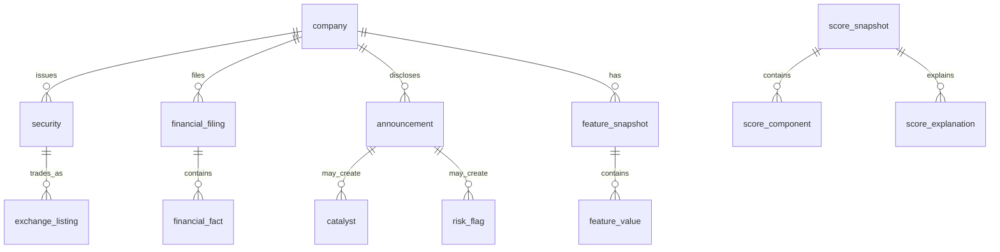

# Data model

## Data rules

PostgreSQL is authoritative. Tables use UUID primary keys, UTC `timestamptz`,
`numeric` monetary values, ISO currency codes, and `snake_case`. Facts are
append-only. Operational records have `created_at` and `updated_at`; facts have
`ingested_at` and are never economically overwritten.

Each time-sensitive fact retains `reported_at`, `published_at`, `available_at`,
`revision_at`, and `ingested_at`; financial records also reference a fiscal
period. `available_at` means a reasonable participant could act on it. A
point-in-time (PIT) query must select only revisions with
`available_at <= knowledge_cutoff`. An optional stricter replay also requires
`ingested_at <= knowledge_cutoff`.

## Entity relationships

## Complete schema catalogue

### Reference and identity

| Table | Core columns / constraints | Purpose |
|---|---|---|
| `exchange` | `id`, unique `mic`, `code`, `name`, `country` | NSE, BSE, future exchanges |
| `company` | `id`, canonical/legal names, status, effective dates | Canonical issuer, never symbol-keyed |
| `company_alias` | company, alias/type, valid dates; unique alias/type/from | Rename and historical search |
| `security` | company, ISIN, security/share-class type, status, valid dates | Tradeable share class |
| `exchange_listing` | security/exchange, symbol, exchange code, status, valid dates | Dated NSE/BSE identity |
| `classification` | scheme, code, name, parent | Sector/industry taxonomy |
| `company_classification` | company/classification, valid dates, source | Historical classification |
| `corporate_action` | security, provider dataset, type, exact ratio/value/currency terms, exchange/old/new symbol/successor ISIN, ex/record/effective dates, source/time fields | Append-only split, bonus, dividend, rights, and identity-change evidence |
| `security_relationship` | predecessor/successor securities, type, effective date, source/time fields | Explicit ISIN/security succession without rewriting history |
| `company_relationship` | from/to company, relationship, effective date, source | Successor/predecessor lineage |

### Provenance, providers, and documents

| Table | Core columns / constraints | Purpose |
|---|---|---|
| `data_provider` | unique code, type, licence name, terms URL, enabled, config ref | Adapter registry; no secrets |
| `provider_dataset` | provider, dataset code, licence class, retention, redistributable | Feed-level permissions |
| `ingestion_run` | dataset, status, start/end, cursor/watermark, counters, error | Job audit and idempotency |
| `source_record` | run, external ID, URL/object key, raw record locator, content hash, all time fields, parse status | Immutable input provenance |
| `data_quality_issue` | source/entity, rule, severity, message, lifecycle | Quarantine and review |
| `document` | company, type, title, URL, object key, unique SHA-256, language, source/time fields | Filing/announcement metadata |
| `document_text` | document PK, extracted text/key, extractor version, checksum, page map | Searchable document text |
| `document_interpretation` | document, task, schema/model/prompt versions, output JSON, confidence, evidence, review state | Auditable AI output |

Document bytes are content-addressed in local/S3-compatible object storage;
PostgreSQL stores metadata, checksums, extraction, and citations rather than
large blobs. Every normalized fact references a `source_record`.

### Market, benchmarks, ownership, and attention

| Table | Core columns / constraints | Purpose |
|---|---|---|
| `price_bars` | security, date, interval, raw OHLCV, optional provider-reported INR market cap, optional delivery quantity/fraction, revision/source/time fields | Implemented raw observations with Phase 3G-A PIT reads; no adjusted values |
| `benchmark_series` / `benchmark_bars` | provider-dataset-local benchmark identity; raw daily OHLC/revision/source fields | Implemented raw observations with provider-local Phase 3G-A PIT reads |
| `price_adjustment` | security, effective date, adjustment type/factor, corporate action, source | Deferred; reproducible adjusted-price input |
| `institutional_holding` | company, holder category/name, shares/percent, as-of date, source/time fields | Promoter, MF, FII/FPI, pledge holdings |
| `attention_observation` | company, metric code, value, window, source/time fields, quality | Extensible attention proxies |

Index price data on `(security_id, trading_date desc, available_at)` and other
time series on `(company_id, as_of_date desc, available_at)`. Partition the
largest daily fact tables by calendar year only once real volume warrants it.

### Financial reporting

| Table | Core columns / constraints | Purpose |
|---|---|---|
| `fiscal_period` | company, quarter/half-year/nine-month/annual, start/end, FY, quarter, YTD flag | Reported period identity; no TTM |
| `financial_filing` | company, provider filing identity, standalone/consolidated, type, restatement flag, source/time fields | Immutable report header, containing many period facts |
| `financial_metric_definition` | code PK, statement kind, expected sign, unit category, formula ref | Controlled dictionary |
| `financial_fact` | filing, fiscal period, metric code, reported value/unit/scale/currency, normalized value, source/time fields | Append-only reported income/BS/CF line items |
| `financial_fact_link` | derived fact, input fact, relationship | Deterministic lineage |

`financial_metric_definition.statement_kind` distinguishes income statement,
balance sheet, and cash flow; this is more durable than three sparse wide
tables. Future financial API projections can expose typed `IncomeStatement`,
`BalanceSheet`, and `CashFlow` read models; Phase 1 exposes only the canonical
company identity graph. Definitions cover revenue, operating revenue, other income,
EBITDA, EBIT, operating profit, PAT, EPS, exceptional items, tax, interest,
assets, liabilities, equity, debt, cash, inventory, receivables, payables,
CFO, CFI, CFF, and reported capex. Reported values are never replaced by
calculated values; no FCF metric is derived until capex sign semantics are
controlled.

Phase 3B does not add a derived-quarter table. `FinancialFact` remains the
immutable reported observation, while the read-only period normalizer returns
an ephemeral value with selected component facts as lineage. Only metric
definitions marked `duration` and `monetary` may be cumulatively subtracted;
instant and per-share values remain non-derivable. Reported quarter facts take
priority over a possible YTD difference.

Phase 3C likewise adds no TTM table or derived fiscal period. Its read-only
TTM result is a sum of four contiguous Phase 3B quarter values, retaining the
four nested quarter lineages and their immutable source facts. It is available
only when every component is PIT-visible and does not use an annual/YTD
alternate formula.

Phase 3D adds no feature persistence. Growth, acceleration, margins, and margin
expansion are ephemeral PIT calculations over Phase 3B quarterized lineage;
configuration thresholds and scoring are deliberately deferred.

Phase 3E-A likewise adds no snapshot table. An ephemeral instant financial
snapshot contains only PIT-selected `instant` + `monetary` facts normalized to
INR, and every component shares the exact same stored `FiscalPeriod.id`.
Latest-common selection orders candidate periods by economic `period_end`; a
late observation for an older period cannot displace a newer complete period.
Distinct period IDs tied at the maximum end date are ambiguous and fail closed.
Every component retains its full `PointInTimeFinancialFact` lineage.

Phase 3E-B adds no leverage or capital-efficiency tables. Its ephemeral result
objects retain complete snapshot and TTM inputs. ROE and ROCE require exact
beginning/end economic dates through unambiguous same-`FiscalPeriod.id`
snapshots; missing or ambiguous boundaries are not replaced with nearby data.
Non-positive denominator conditions remain explicit warnings rather than
repaired or sentinel values.

Phase 3E-C adds no cash-flow-quality or working-capital tables. Its ephemeral
results retain complete TTM and instant-snapshot lineage. CFO conversion and
CFO/EBITDA require identical TTM contexts and windows. Receivable days and
trade working-capital change use exact, unambiguous beginning and ending
balance-sheet period IDs anchored by a PIT-clean TTM revenue window. Reported
capex remains source data only: no FCF is derived until its sign convention is
encoded in controlled metric metadata. COGS and purchases are not fabricated,
so inventory days, payable days, and CCC remain unimplemented.

Phase 3F adds no growth-window, consistency, or persistence tables. Its
ephemeral results retain complete Phase 3D `QuarterGrowthValue` objects and
their nested source lineage. Only complete consecutive fixed windows of
percentage-mode YoY observations are admissible; absolute-change transitions
and missing endpoints are not skipped. Window size and persistence threshold
are request inputs rather than stored policy or application constants.

### Events, interpretation, and risk

| Table | Core columns / constraints | Purpose |
|---|---|---|
| `announcement` | company, optional listing/security, category, headline, external ID, source/document/time fields | Disclosure event |
| `event_evidence` | parent type/id, source/doc/announcement, excerpt, locator/page, confidence | Citable evidence |
| `catalyst` | company, source refs, type/direction/materiality, confidence, status, source/time fields, review state | Capacity/order/product catalysts |
| `risk_flag` | company, category, severity, status, confidence, source/time fields, review state | Financial/governance/liquidity etc. |
| `management_commitment` | company/document, promise text/type, target date/value, status, evidence/confidence | Management promise tracking |

Multiple evidence rows can support one interpretation. AI-created catalyst or
risk rows remain provisional until review and may be excluded by configuration.

### Features, models, and opportunity scores

| Table | Core columns / constraints | Purpose |
|---|---|---|
| `feature_definition` | code PK, domain/version, type/unit, formula ref, eligibility | Formula contract |
| `feature_snapshot` | company, as-of date, knowledge cutoff, calculation version, manifest, status | Immutable PIT envelope |
| `feature_value` | snapshot, feature code, value, confidence, input lineage, quality | Deterministic feature output |
| `model_versions` | model family, unique semantic version, Git SHA, status, dates | Immutable model-semantics identity; implemented in Phase 4A |
| `scoring_configurations` | model version, name/version, half-open effective range, validated policy JSON, SHA-256 checksum, status | Immutable versioned policy; implemented in Phase 4A |
| `score_snapshots` | company, cutoff/endpoint, config/model, eligibility/confidence, context, fingerprint/manifests, nullable final score | Immutable partial scoring audit; implemented in Phase 4C |
| `score_components` | snapshot, component score, configured top-level weight, subfactor coverage/detail, nullable final contribution | Immutable component audit; v1 supports Financial Inflection and v2 supports four approved financial components |
| `score_explanations` | snapshot/component, factor values/weights/contribution, rank/template, evidence manifest | Structured mathematical explanation, including transform audit metadata in v2 manifests |

Index opportunity ranking on `(as_of_date, final_score desc)` and historical
company scores on `(company_id, as_of_date desc)`. Recalculations insert a new
snapshot rather than update a historical score.

Phase 4A creates only `model_versions` and `scoring_configurations`. The latter
uses portable SQLAlchemy JSON with PostgreSQL JSONB as its production variant,
an indexed canonical checksum, a restrictive model-version foreign key, and a
unique `(model_version_id, configuration_name, configuration_version)`
identity. Feature and score tables in this catalogue remain future design and
are not created by the Phase 4A migration.

Phase 4B adds no schema. Its optional typed Financial Inflection scoring policy
is carried in the existing immutable configuration JSON. In-memory component
and subfactor results retain Phase 3 evidence references but are not
automatically persisted by the pure scorer; Phase 4C owns that separate
persistence boundary.

Phase 4C adds only `score_snapshots`, `score_components`, and
`score_explanations`. Snapshot fingerprints are unique; component code is
unique per snapshot; factor code is unique per component. Exact Decimal columns
use wide PostgreSQL numeric storage and exact SQLite text adaptation. All Phase
4C final-score and final-contribution values remain null. `feature_snapshot`
and `feature_value` are still future design.

Phase 4D-A adds no schema. Its optional typed Business Quality policy remains
inside immutable `scoring_configurations.configuration_json`, and its pure
component/subfactor results retain Phase 3 evidence only in memory. Phase 4C
continues to persist Financial Inflection alone; Business Quality persistence
requires a later, separately reviewed orchestration design.

Phase 4D-B also adds no schema. Its optional Cash-Flow Quality policy is carried
by the same immutable configuration JSON. In-memory subfactor results retain
the accounting raw value, any revenue-normalized raw ratio, the explicit
scoring transform, and the complete Phase 3E-C evidence object. Phase 4C does
not yet persist those results.

Phase 4D-C adds no schema. Its optional Balance Sheet policy remains in the
immutable configuration JSON. Pure in-memory results retain raw INR net debt,
the paired TTM EBITDA denominator, normalized leverage ratios, explicit scoring
signals, and original Phase 3E-B evidence.

Phase 4D-D also adds no schema. The existing generic score tables store the new
`score_snapshot_v2` audit contract: up to four component rows from one selected
provider/scope, component-specific explanation templates, transform metadata
inside evidence manifests, and a selected-component lineage union. Historical
`score_snapshot_v1` rows remain valid and Financial-Inflection-only. Both
versions require null final scores and null final contributions.

### Personal workflow, alerts, and operations

| Table | Core columns / constraints | Purpose |
|---|---|---|
| `app_user` | unique login, password hash, active, last login | One seeded local user |
| `watchlist_item` | user/company unique, status, dates | Research workflow |
| `research_note` | user/company, note type, markdown, version, dates | Thesis and notes |
| `alert` | user/company, type, dedupe key, body, score refs, confidence, read state | In-app alerts |
| `alert_delivery` | alert, channel, attempts/status/error | Future delivery audit |
| `job_run` | job type, correlation ID, status, counters, trace/error, dates | Worker observability |
| `provider_health` | provider, checked at, freshness, failures, last success | Data health dashboard |

### Backtesting and research reproducibility

| Table | Core columns / constraints | Purpose |
|---|---|---|
| `dataset_manifest` | cutoff, source watermarks, Parquet paths/checksums, schema version | Immutable analytical input |
| `backtest` | name, user, immutable strategy JSON, status | Saved experiment |
| `backtest_run` | backtest, manifest/config/model, code SHA, assumptions, status, metrics | Exact execution |
| `backtest_rebalance` | run/date, eligible count, selections, turnover/costs | PIT decision record |
| `backtest_position` | rebalance/company, weight, entry/exit, return/exclusion | Holdings audit |
| `backtest_timeseries` | run/date, NAV, benchmark NAV, drawdown, exposure | Charts and metrics |
| `historical_winner_study` | company, window/threshold, manifest, outcome | Winner/false-positive cohorts |

## Integrity and PIT contract

Use restrictive foreign keys for facts and soft status changes for companies.
Checks enforce valid dates, non-negative volume, delivery fraction 0–1, valid
OHLC, revision sequence, and bounded scores. Ingestion validates duplicate
identities, missing periods, impossible ratios, scales, and outliers, creating
`data_quality_issue` records instead of silently dropping rows.

The financial PIT repository requires `as_of` and returns the latest available
revision per economic key. Raw market and benchmark storage and their read-only
Phase 3G-A PIT APIs are implemented. PIT selections are immutable views and are
not persisted. Phase 3G-B likewise returns non-persisted split/bonus adjustment
factors, adjusted OHLC views, and adjacent simple returns. No `price_adjustment`,
adjusted-price, or return table is implemented; total returns and broader
derived analytics remain deferred.
Phase 3H-A adds no table. Its valuation bundle is an immutable in-memory union
of a selected atomic `price_bars` observation, independently constructed TTM
values, and exact-FY/Q instant snapshots. It retains raw lineage and exact
Decimal values. No valuation feature, percentile, or score is persisted.
PIT fixtures must include a late filing and a later restatement to prove that
future knowledge cannot leak into features, scores, or backtests.

Phase 3A's financial reader uses the immutable economic identity
`provider_dataset + company + fiscal_period + filing_scope + metric`. It filters
accepted source-backed facts using the inclusive predicate
`financial_fact.available_at <= as_of`, then selects the latest eligible
revision deterministically. `ingested_at` is only a final tie-breaker and never
a knowledge-time proxy. No schema migration or composite index is added at the
current synthetic/personal scale: existing financial-fact foreign-key indexes
and filing/company/provider filtering support the narrow read path. Reassess a
composite index only with measured PostgreSQL query volume.
