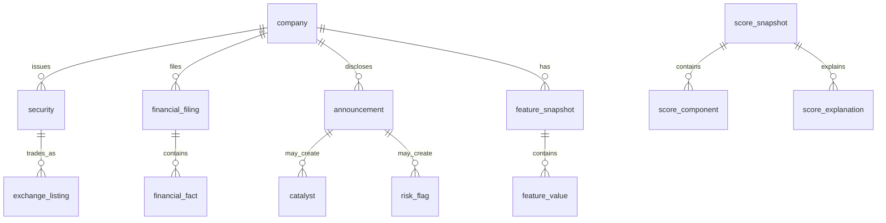

# Data model

## Data rules

PostgreSQL is authoritative. Tables use UUID primary keys, UTC `timestamptz`,
`numeric` monetary values, ISO currency codes, and `snake_case`. Facts are
append-only. Operational records have `created_at` and `updated_at`; facts have
`ingested_at` and are never economically overwritten.

Each time-sensitive fact retains `reported_at`, `published_at`, `available_at`,
`revision_at`, and `ingested_at`; financial records also reference a fiscal
period. `available_at` means a reasonable participant could act on it. A
point-in-time (PIT) query must select only revisions with
`available_at <= knowledge_cutoff`. An optional stricter replay also requires
`ingested_at <= knowledge_cutoff`.

## Entity relationships

## Complete schema catalogue

### Reference and identity

| Table | Core columns / constraints | Purpose |
|---|---|---|
| `exchange` | `id`, unique `mic`, `code`, `name`, `country` | NSE, BSE, future exchanges |
| `company` | `id`, canonical/legal names, status, effective dates | Canonical issuer, never symbol-keyed |
| `company_alias` | company, alias/type, valid dates; unique alias/type/from | Rename and historical search |
| `security` | company, ISIN, security/share-class type, status, valid dates | Tradeable share class |
| `exchange_listing` | security/exchange, symbol, exchange code, status, valid dates | Dated NSE/BSE identity |
| `classification` | scheme, code, name, parent | Sector/industry taxonomy |
| `company_classification` | company/classification, valid dates, source | Historical classification |
| `corporate_action` | security, type, ex/record date, split ratio/cash, source/time fields | Split, bonus, dividend, merger, delisting |
| `company_relationship` | from/to company, relationship, effective date, source | Successor/predecessor lineage |

### Provenance, providers, and documents

| Table | Core columns / constraints | Purpose |
|---|---|---|
| `data_provider` | unique code, type, licence name, terms URL, enabled, config ref | Adapter registry; no secrets |
| `provider_dataset` | provider, dataset code, licence class, retention, redistributable | Feed-level permissions |
| `ingestion_run` | dataset, status, start/end, cursor/watermark, counters, error | Job audit and idempotency |
| `source_record` | run, external ID, URL/object key, content hash, raw key, all time fields, parse status | Immutable input provenance |
| `data_quality_issue` | source/entity, rule, severity, message, lifecycle | Quarantine and review |
| `document` | company, type, title, URL, object key, unique SHA-256, language, source/time fields | Filing/announcement metadata |
| `document_text` | document PK, extracted text/key, extractor version, checksum, page map | Searchable document text |
| `document_interpretation` | document, task, schema/model/prompt versions, output JSON, confidence, evidence, review state | Auditable AI output |

Document bytes are content-addressed in local/S3-compatible object storage;
PostgreSQL stores metadata, checksums, extraction, and citations rather than
large blobs. Every normalized fact references a `source_record`.

### Market, benchmarks, ownership, and attention

| Table | Core columns / constraints | Purpose |
|---|---|---|
| `price_bar` | security, date, interval, OHLC, adjusted close, volume, delivery, cap, revision, source/time fields | Daily data first, intraday-ready |
| `price_adjustment` | security, effective date, adjustment type/factor, corporate action, source | Reproducible adjusted prices |
| `benchmark_series` / `benchmark_bar` | benchmark identity; date/interval/value/revision/source | Index comparison |
| `institutional_holding` | company, holder category/name, shares/percent, as-of date, source/time fields | Promoter, MF, FII/FPI, pledge holdings |
| `attention_observation` | company, metric code, value, window, source/time fields, quality | Extensible attention proxies |

Index price data on `(security_id, trading_date desc, available_at)` and other
time series on `(company_id, as_of_date desc, available_at)`. Partition the
largest daily fact tables by calendar year only once real volume warrants it.

### Financial reporting

| Table | Core columns / constraints | Purpose |
|---|---|---|
| `fiscal_period` | company, quarter/annual/TTM, start/end, FY, quarter, audit flag | Period identity |
| `financial_filing` | company, fiscal period, standalone/consolidated, type, restatement flag, source/time fields | Report/filing header |
| `financial_metric_definition` | code PK, statement kind, expected sign, unit category, formula ref | Controlled dictionary |
| `financial_fact` | filing, metric code, reported value/unit, normalized INR value, scale, currency, source/time fields | All income/BS/CF line items |
| `financial_fact_link` | derived fact, input fact, relationship | Deterministic lineage |

`financial_metric_definition.statement_kind` distinguishes income statement,
balance sheet, and cash flow; this is more durable than three sparse wide
tables. Phase 1 exposes typed `IncomeStatement`, `BalanceSheet`, and `CashFlow`
read models. Definitions cover revenue, operating revenue, other income,
EBITDA, EBIT, operating profit, PAT, EPS, exceptional items, tax, interest,
assets, liabilities, equity, debt, cash, inventory, receivables, payables,
CFO, CFI, CFF, capex, and reported FCF. Reported values are never replaced by
calculated values.

### Events, interpretation, and risk

| Table | Core columns / constraints | Purpose |
|---|---|---|
| `announcement` | company, optional listing/security, category, headline, external ID, source/document/time fields | Disclosure event |
| `event_evidence` | parent type/id, source/doc/announcement, excerpt, locator/page, confidence | Citable evidence |
| `catalyst` | company, source refs, type/direction/materiality, confidence, status, source/time fields, review state | Capacity/order/product catalysts |
| `risk_flag` | company, category, severity, status, confidence, source/time fields, review state | Financial/governance/liquidity etc. |
| `management_commitment` | company/document, promise text/type, target date/value, status, evidence/confidence | Management promise tracking |

Multiple evidence rows can support one interpretation. AI-created catalyst or
risk rows remain provisional until review and may be excluded by configuration.

### Features, models, and opportunity scores

| Table | Core columns / constraints | Purpose |
|---|---|---|
| `feature_definition` | code PK, domain/version, type/unit, formula ref, eligibility | Formula contract |
| `feature_snapshot` | company, as-of date, knowledge cutoff, calculation version, manifest, status | Immutable PIT envelope |
| `feature_value` | snapshot, feature code, value, confidence, input lineage, quality | Deterministic feature output |
| `model_version` | model family, unique semantic version, Git SHA, status, dates | Version every model |
| `scoring_configuration` | model version, effective range, weights/thresholds JSON, checksum, status | Versioned policy |
| `score_snapshot` | company, as-of/cutoff, config/model, score/confidence/eligibility, feature refs | Immutable final score |
| `score_component` | score snapshot, component, raw/normalized score, weight/contribution/confidence | Component audit |
| `score_explanation` | score snapshot, factor/direction/contribution/evidence/rank/template | Human-readable explanation |

Index opportunity ranking on `(as_of_date, final_score desc)` and historical
company scores on `(company_id, as_of_date desc)`. Recalculations insert a new
snapshot rather than update a historical score.

### Personal workflow, alerts, and operations

| Table | Core columns / constraints | Purpose |
|---|---|---|
| `app_user` | unique login, password hash, active, last login | One seeded local user |
| `watchlist_item` | user/company unique, status, dates | Research workflow |
| `research_note` | user/company, note type, markdown, version, dates | Thesis and notes |
| `alert` | user/company, type, dedupe key, body, score refs, confidence, read state | In-app alerts |
| `alert_delivery` | alert, channel, attempts/status/error | Future delivery audit |
| `job_run` | job type, correlation ID, status, counters, trace/error, dates | Worker observability |
| `provider_health` | provider, checked at, freshness, failures, last success | Data health dashboard |

### Backtesting and research reproducibility

| Table | Core columns / constraints | Purpose |
|---|---|---|
| `dataset_manifest` | cutoff, source watermarks, Parquet paths/checksums, schema version | Immutable analytical input |
| `backtest` | name, user, immutable strategy JSON, status | Saved experiment |
| `backtest_run` | backtest, manifest/config/model, code SHA, assumptions, status, metrics | Exact execution |
| `backtest_rebalance` | run/date, eligible count, selections, turnover/costs | PIT decision record |
| `backtest_position` | rebalance/company, weight, entry/exit, return/exclusion | Holdings audit |
| `backtest_timeseries` | run/date, NAV, benchmark NAV, drawdown, exposure | Charts and metrics |
| `historical_winner_study` | company, window/threshold, manifest, outcome | Winner/false-positive cohorts |

## Integrity and PIT contract

Use restrictive foreign keys for facts and soft status changes for companies.
Checks enforce valid dates, non-negative volume, delivery percent 0–100, valid
OHLC, revision sequence, and bounded scores. Ingestion validates duplicate
identities, missing periods, impossible ratios, scales, and outliers, creating
`data_quality_issue` records instead of silently dropping rows.

The repository API for financial/event/market facts requires `as_of` and
`knowledge_cutoff`; it returns the latest available revision per economic key.
PIT fixtures must include a late filing and a later restatement to prove that
future knowledge cannot leak into features, scores, or backtests.
